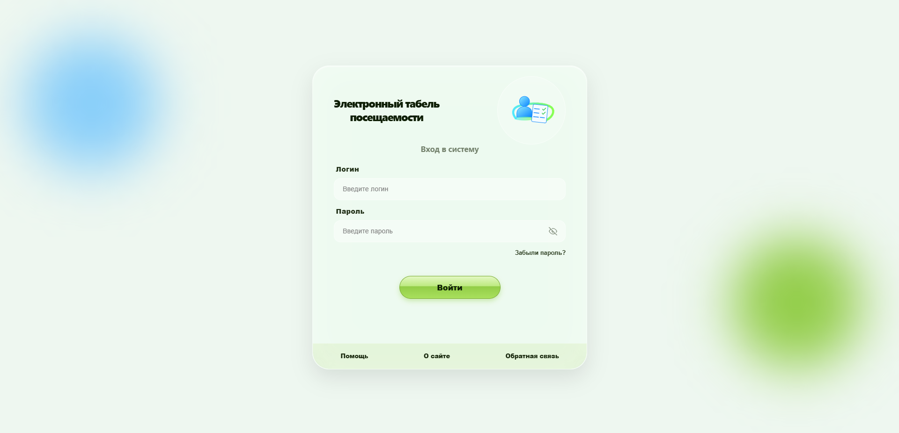

# 📚 Электронный табель посещаемости

Веб-приложение для учёта посещаемости в стиле **Frutiger Aero**.



---

## 🎨 Особенности дизайна

- **Стеклянная эстетика** — размытие, блики, полупрозрачность
- **Анимированный фон** — плавно движущиеся цветные шары
- **Плавные анимации** появления элементов

---

## ✨ Функционал

### 🔐 Авторизация (`/login`)
- Поля ввода **Логин** и **Пароль**
- **Глазик** — показывает/скрывает пароль
- **Подсказка** при фокусе на поле (исчезает через 5 сек)
- **Модальные окна** — Помощь, О сайте, Обратная связь (автозакрытие через 5 сек)

### 🚀 Маршрутизация
| Страница | Путь |
|----------|------|
| Авторизация | `/login` |
| Главная студента | `/student` |
| Главная преподавателя | `/teacher` |

---

## 🛠️ Технологии

- **React 18** + **TypeScript**
- **Vite** — сборка
- **React Router DOM** — маршрутизация
- **SCSS Modules** — стили

---

## 🚀 Запуск

```bash
npm install
npm run dev
